# Livraison - Guide d'utilisation complète

Le module **Livraison** d'Azur Web est l'interface dédiée aux chauffeurs pour la gestion des livraisons en tournée. Ce guide décrit pas à pas l'utilisation de l'application.

---

## Accès au module

Depuis le menu principal à gauche d'Azur Web, cliquez sur **Tâches** pour accéder à la liste des livraisons.

---

## 1. Tableau de bord (Overview)

Le tableau de bord présente une vue d'ensemble de l'activité de livraison sur une période sélectionnée.

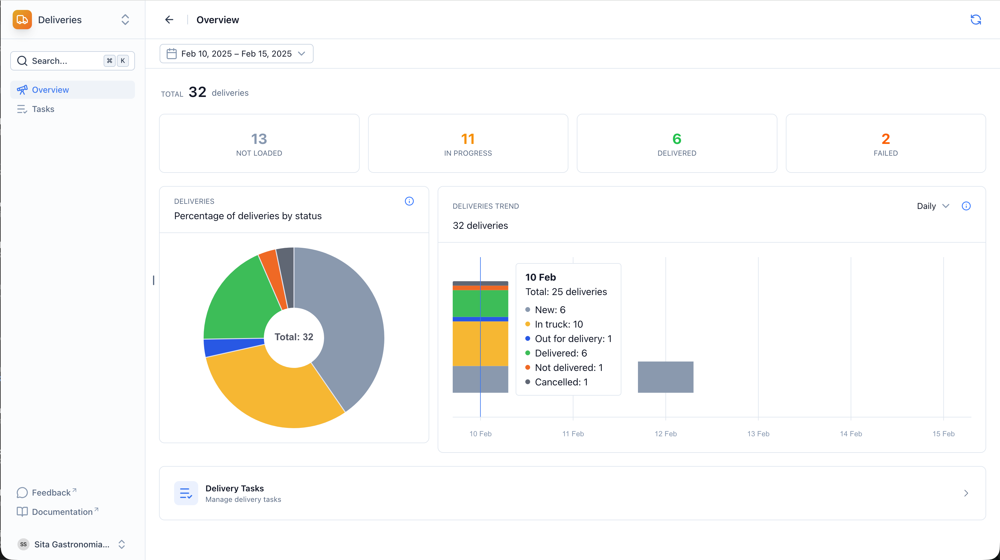

### Sélection de la période
En haut de la page, utilisez le sélecteur de dates pour définir la période d'analyse :
- **Du** : Date de début
- **Au** : Date de fin
- Exemple : *10 févr. 2025 - 15 févr. 2025*

### Indicateurs clés (KPIs)
Quatre cartes affichent les statistiques principales :
- **NOT LOADED** (13) : Livraisons en attente de chargement
- **IN PROGRESS** (11) : Livraisons en cours de traitement  
- **DELIVERED** (6) : Livraisons terminées avec succès
- **FAILED** (2) : Livraisons ayant échoué

### Graphiques
- **Diagramme circulaire** (à gauche) : Répartition en pourcentage des livraisons par statut
- **Graphique d'évolution** (à droite) : Tendance quotidienne avec détail par catégorie :
  - New : Nouvelles livraisons
  - In truck : Chargées dans le camion
  - Out for delivery : En cours de livraison
  - Delivered : Livrées
  - Not delivered : Non livrées
  - Cancelled : Annulées

### Accès rapide
La section **"Delivery Tasks"** en bas de la page permet d'accéder directement à la liste des livraisons.

---

## 2. Liste des tâches de livraison

La page **Tâches de livraison** affiche toutes les livraisons à effectuer.

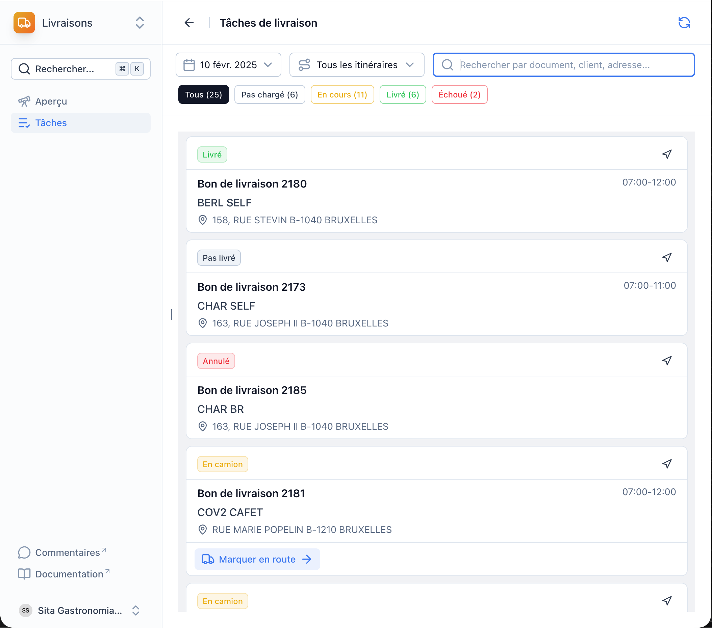

### Barre de filtres
En haut de la liste, trois éléments permettent de filtrer :

1. **Date** : Sélecteur de date (ex: *10 févr. 2025*)
2. **Itinéraire** : Filtre par tournée (ex: *Tous les itinéraires*)
3. **Recherche** : Champ de recherche par document, client ou adresse

### Filtres par statut
Des boutons permettent de filtrer rapidement :
- **Tous (25)** : Toutes les livraisons
- **Pas chargé (6)** : En attente de chargement
- **En cours (11)** : En traitement
- **Livré (6)** : Terminées
- **Échoué (2)** : Échouées

### Informations par livraison
Chaque carte de livraison affiche :
- **Badge de statut** : Couleur indiquant l'état (vert = Livré, jaune = En cours, etc.)
- **Numéro de document** : Bon de livraison ou Facture
- **Nom du client** : Destinataire
- **Adresse** : Adresse complète de livraison
- **Horaire** : Créneau horaire (ex: *07:00-12:00*)
- **Icône navigation** : Flèche pour lancer le GPS

---

## 3. Déroulement d'une livraison

### Étape 1 : Marquer la livraison comme "En route"

Lorsqu'une livraison est chargée dans le camion, son statut est **"En camion"**.

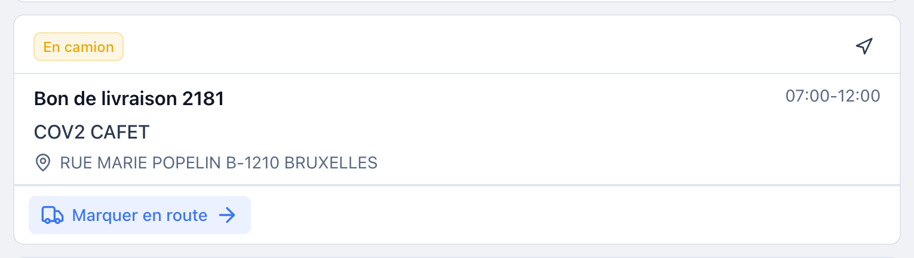

Pour démarrer la livraison :
1. Localisez la livraison avec le badge jaune **"En camion"**
2. Cliquez sur le bouton bleu **"Marquer en route"**
3. Le statut passe automatiquement à **"En route"**

### Étape 2 : En route vers le client

Une fois que vous avez cliqué sur **"Marquer en route"** :

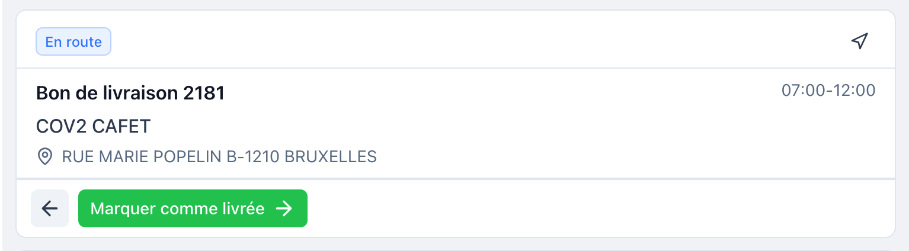

- Le statut passe à **"En route"** (badge bleu)
- Le bouton vert **"Marquer comme livrée"** apparaît
- Vous pouvez utiliser l'icône de navigation (flèche) pour lancer le GPS (optionnel)

> **Important** : Le bouton "Marquer comme livrée" ne doit être cliqué que lorsque vous arrivez **physiquement chez le client** et êtes prêt à effectuer la livraison.

### Étape 3 : Débuter la livraison chez le client

Lorsque vous arrivez à destination chez le client :

1. Cliquez sur le bouton **"Marquer comme livrée"**
2. Vous accédez alors à la page de détail de la livraison

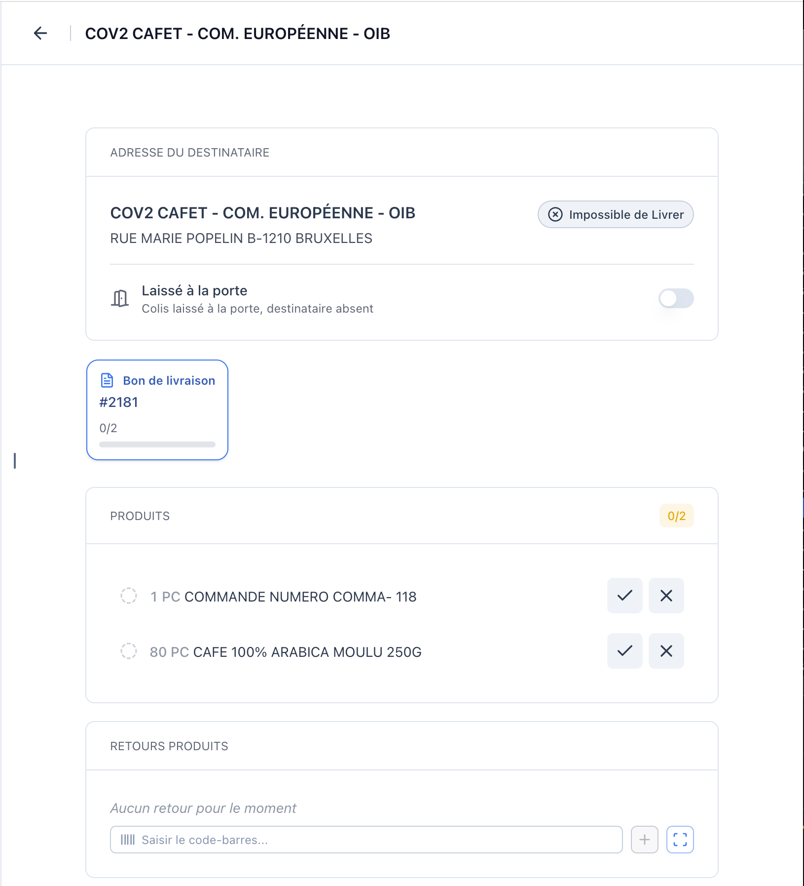

Cette page contient plusieurs sections :

#### En-tête
- **Adresse du destinataire** : Nom et adresse complète
- **Bouton "Impossible de Livrer"** : En haut à droite, pour signaler une livraison impossible

#### Informations document
- **Bon de livraison #2181** : Numéro du document
- **Progression 0/2** : Nombre de produits validés / total
- **Option "Laisse à la porte"** : Toggle si le client autorise le dépôt sans signature

#### Sections principales
1. **Produits** : Liste des articles à livrer
2. **Retours Produits** : Gestion des retours
3. **Pièces jointes** : Photos et documents
4. **Référence document** : Numéro de réception client
5. **Signature** : Zone de signature électronique

---

## 4. Gestion des produits

### Validation des produits

Dans la section **Produits**, vous voyez la liste des articles à livrer :

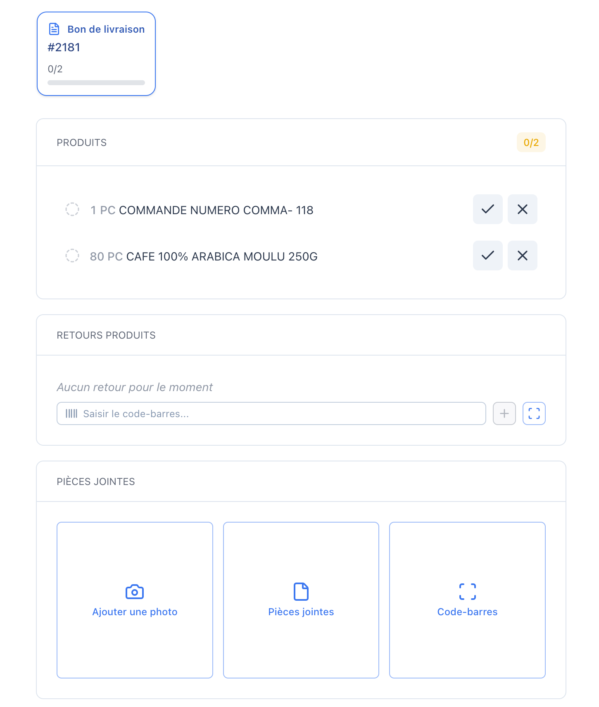

Pour chaque produit :
- **Description** : Désignation et quantité (ex: *80 PC CAFE 100% ARABICA MOULU 250G*)
- **Bouton ✓** (vert) : Confirmer la livraison du produit
- **Bouton ✗** (rouge) : Signaler un problème avec le produit

### Confirmation complète

Lorsque tous les produits sont validés :

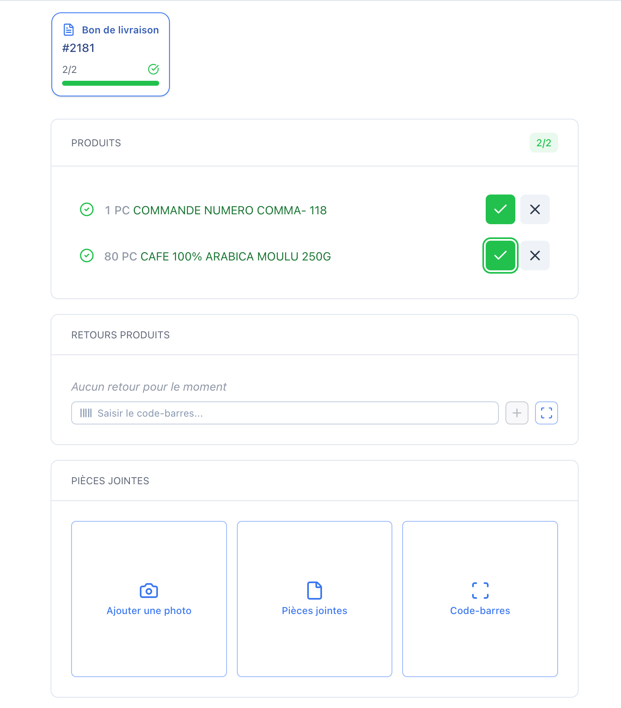

- Le compteur affiche **"2/2"** en vert
- Les produits ont une coche verte à gauche
- La barre de progression est complète
- Le bon de livraison affiche une coche verte

### Gestion des problèmes de produit

Si un produit est endommagé ou refusé :

1. Cliquez sur le bouton **✗** du produit concerné
2. Une fenêtre **"Motif de l'échec"** s'ouvre :

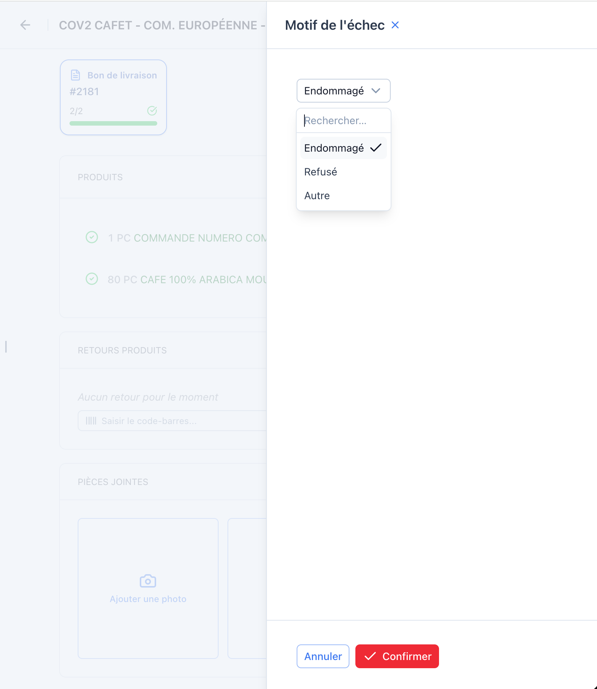

3. Sélectionnez le motif :
   - **Endommagé** : Produit abîmé
   - **Refusé** : Client refuse le produit
   - **Autre** : Autre raison

4. Cliquez sur **Confirmer**

Le produit apparaît alors :
- Barré en rouge
- Avec un badge **"Endommagé"**

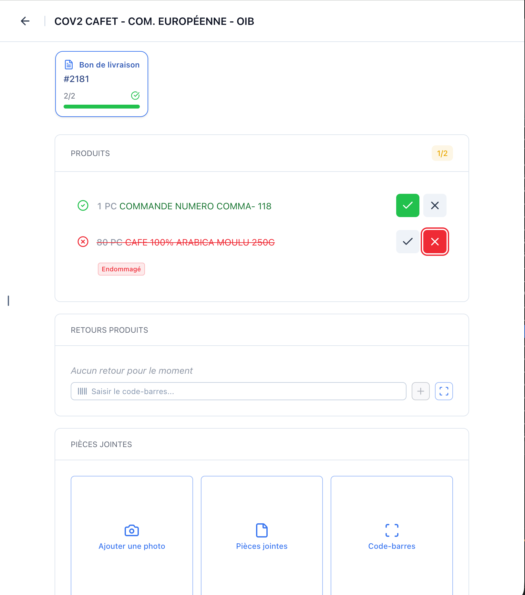

---

## 5. Livraison impossible

Si vous ne pouvez pas livrer du tout :

1. Cliquez sur le bouton **"Impossible de Livrer"** en haut à droite

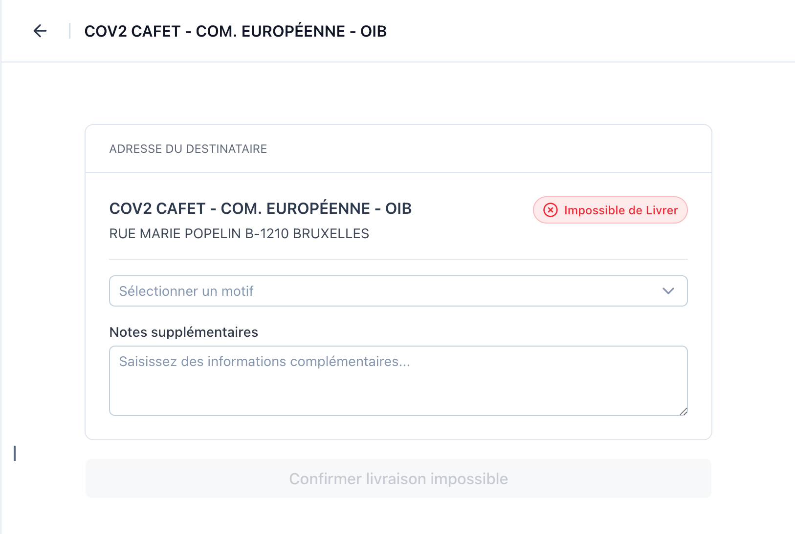

2. Sélectionnez un motif dans la liste :

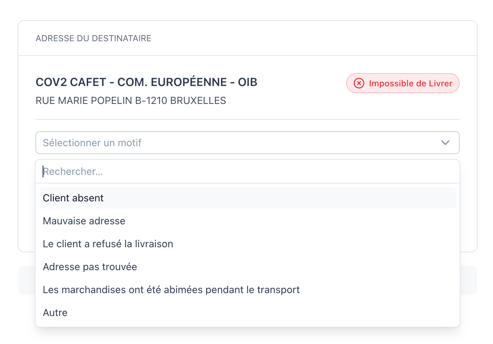

Les motifs disponibles sont :
- **Client absent**
- **Mauvaise adresse**
- **Le client a refusé la livraison**
- **Adresse pas trouvée**
- **Les marchandises ont été abîmées pendant le transport**
- **Autre**

3. Ajoutez des **notes supplémentaires** si nécessaire
4. Cliquez sur **"Confirmer livraison impossible"**

---

## 6. Retours produits

Pour gérer les articles retournés par le client :


### Scanner un retour
1. Dans la section **Retours Produits**
2. Utilisez le champ **"Saisir le code-barres..."**
3. Scannez le code-barres du produit retourné
4. Ou saisissez-le manuellement et cliquez sur **+**

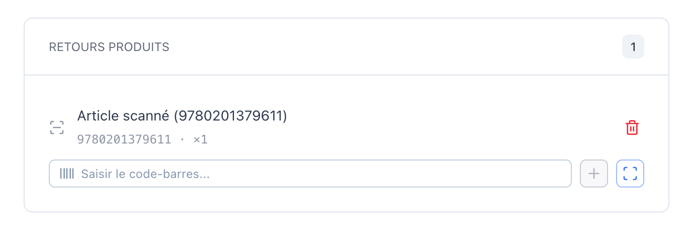

Le produit apparaît dans la liste avec :
- **Description** : "Article scanné (EAN)"
- **Code EAN** : Numéro du produit
- **Quantité** : ×1
- **Corbeille** : Pour supprimer l'article si erreur

---

## 7. Pièces jointes

Ajoutez des preuves de livraison :


Trois options sont disponibles :
- **Ajouter une photo** : Prendre une photo du lieu ou produit
- **Pièces jointes** : Joindre des documents existants
- **Code-barres** : Scanner des codes-barres supplémentaires

---

## 8. Référence du document de réception

Si le client fournit un numéro de réception :

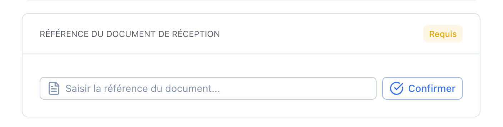

1. Remplissez le champ **"Saisir la référence du document..."**
2. Cliquez sur **Confirmer**

> **Note** : Ce champ peut être requis (*Requis*) selon la configuration.

---

## 9. Signature électronique

La signature du client est obligatoire pour valider la livraison.

### Capture de la signature

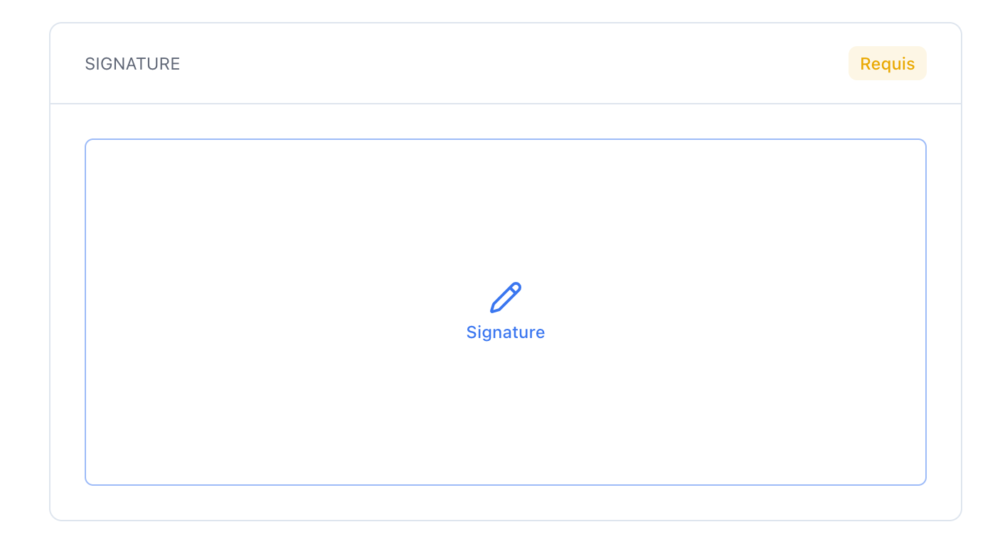

1. Cliquez sur la zone **Signature**
2. Une fenêtre modale s'ouvre :

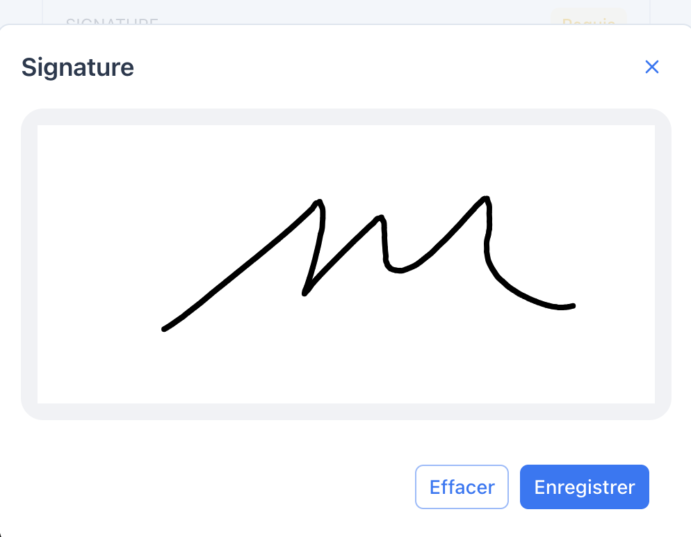

3. Le client signe avec son doigt ou un stylet dans la zone blanche
4. Cliquez sur **Enregistrer** pour sauvegarder
   - Ou **Effacer** pour recommencer

### Signature enregistrée

Une fois enregistrée :

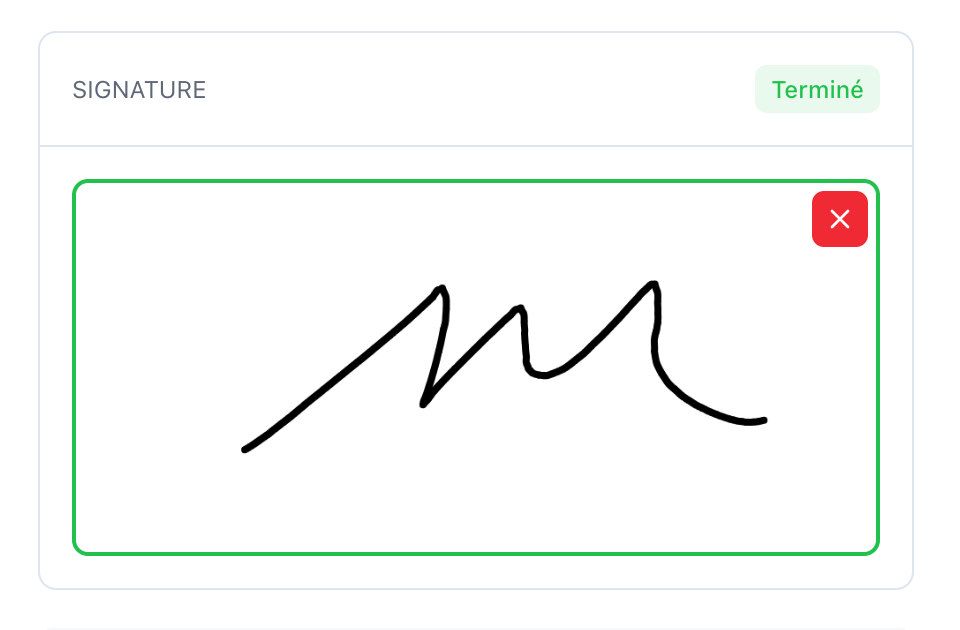

- Le statut affiche **"Terminé"** en vert
- La signature apparaît dans la zone
- Un bouton **×** rouge permet de supprimer et refaire la signature si nécessaire

---

## 10. Confirmation finale

Lorsque tout est complété :
- ✅ Produits validés (tous les articles traités)
- ✅ Retours enregistrés (si applicable)
- ✅ Pièces jointes ajoutées (si requis)
- ✅ Référence saisie (si requis)
- ✅ Signature obtenue

Cliquez sur le bouton vert **"Confirmer"** :

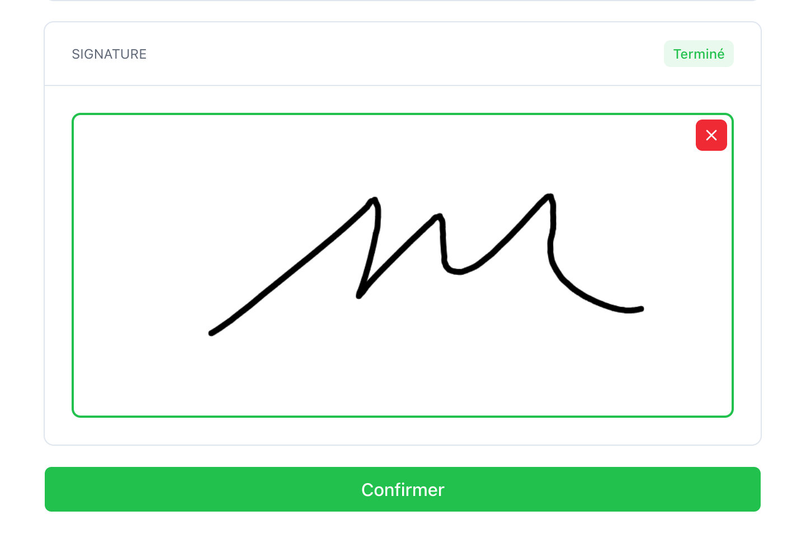

La livraison est alors :
- Marquée comme **Livré**
- Déplacée dans l'historique
- Synchronisée avec le système Azur principal

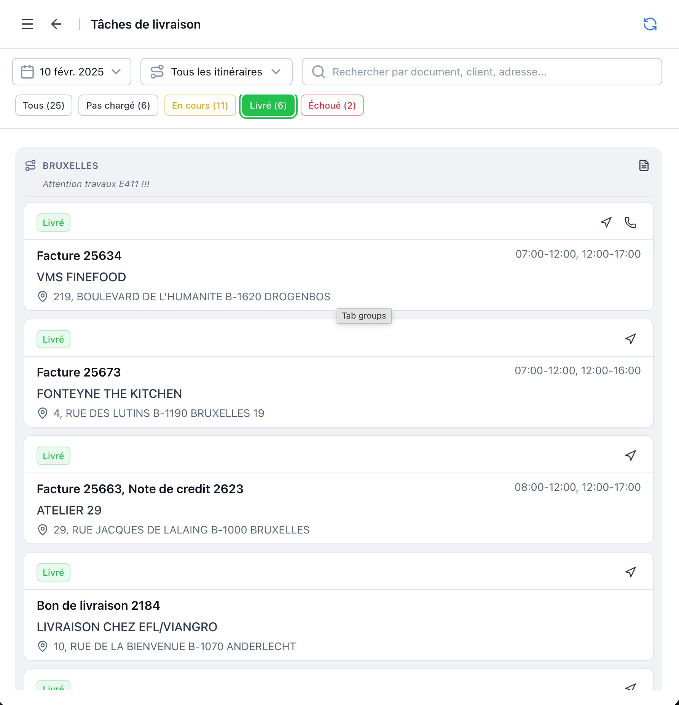

---

## Fonctionnalités complémentaires

### Appel téléphonique
Certaines livraisons affichent une icône **téléphone** permettant d'appeler directement le client depuis l'application.

### Groupes d'itinéraires
Les livraisons sont groupées par itinéraire (ex: **BRUXELLES**) avec éventuellement des notes comme *"Attention travaux E411 !!!"*.

### Documents multiples
Une livraison peut contenir plusieurs documents (ex: *Facture 25663, Note de credit 2623*). Vous pouvez cliquer sur chaque document pour afficher les détails des produits ou des colis contenus dans ce document.

---

## Récapitulatif du flux

```
1. Dashboard → Vérifier la charge de travail
2. Tasks → Sélectionner la livraison
3. "Marquer en route" → Indiquer que vous partez en livraison
4. Navigation GPS → Se rendre chez le client (optionnel)
5. "Marquer comme livrée" → Arrivé chez le client, débuter la livraison
6. Valider les produits → Confirmer chaque article livré
7. Gérer les retours → Scanner les articles retournés si nécessaire
8. Ajouter des photos → Preuve de livraison
9. Signature → Obtenir la signature du client
10. Confirmer → Finaliser la livraison
```

---

## Support

En cas de problème technique ou de question sur l'utilisation, contactez le support Sita Software.
